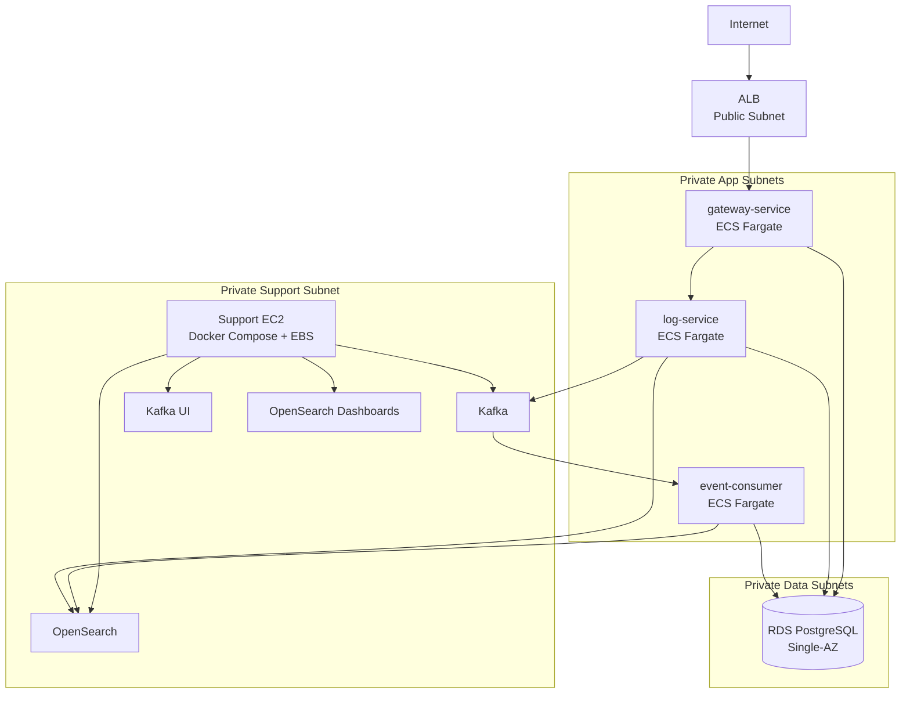

# Log Analyzer AWS MVP Architecture

## Purpose

로그 분석기 프로젝트의 AWS MVP 배치 구조를 정의한다.

핵심 절충안은 비용은 낮추되, AWS 이식 경험과 운영 구조는 최대한 살리는 것이다. 애플리케이션은 ECS Fargate, DB는 RDS PostgreSQL을 사용하고, 비용이 큰 Kafka와 OpenSearch는 Support EC2 1대에서 Docker Compose로 직접 운영한다.

## MVP Architecture Summary

| 영역 | MVP 선택 | 이유 | Production 전환 |
|---|---|---|---|
| Ingress | ALB | 외부 HTTP 진입점, ECS target group 연동 경험 확보 | WAF, ACM, Route 53 추가 |
| Backend | ECS Fargate | 컨테이너 운영, task definition, service, IAM, CloudWatch 경험 확보 | desired count 확대, Auto Scaling 적용 |
| Database | RDS PostgreSQL Single-AZ | DB 직접 운영 부담 제거, 비용 절감 | Multi-AZ, read replica, 백업 정책 강화 |
| Kafka | Support EC2 + Docker Compose | MSK 비용 절감, 이벤트 구조 유지 | Amazon MSK |
| OpenSearch | Support EC2 + Docker Compose | Amazon OpenSearch Service 비용 절감, 검색/색인 구조 유지 | Amazon OpenSearch Service |
| Storage | EC2 EBS | Kafka/OpenSearch 데이터 영속화 | MSK/OpenSearch Service 내부 스토리지 |
| Secrets | SSM Parameter Store / Secrets Manager | DB 비밀번호와 접속정보를 코드에서 분리 | rotation, fine-grained IAM |
| CI/CD | GitHub Actions → ECR → ECS Deploy | 이미지 배포 파이프라인 경험 확보 | blue/green 또는 canary 배포 |
| Observability | CloudWatch Logs/Metrics/Alarm/Dashboard | 최소 운영 가시성 확보 | OpenTelemetry, X-Ray, 상세 알람 |
| IaC | Terraform | VPC, SG, ECS, ALB, RDS, EC2 재현성 확보 | module 분리 및 environment 분리 |

## Service Placement

| 서비스 | 배치 위치 | 접근 범위 | 비고 |
|---|---|---|---|
| ALB | Public Subnet | Internet → ALB | 외부 요청의 유일한 HTTP 진입점 |
| gateway-service | ECS Fargate, Private Subnet | ALB → gateway-service | public IP 비활성화 |
| log-service | ECS Fargate, Private Subnet | gateway-service → log-service | 내부 통신만 허용 |
| event-consumer | ECS Fargate, Private Subnet | Kafka consume, OpenSearch index | ALB target 아님 |
| RDS PostgreSQL | Private DB Subnet | ECS services → RDS | 외부 직접 접근 금지 |
| Support EC2 | Private Subnet | ECS → Kafka/OpenSearch, 관리자 → Session Manager 포트 포워딩 | Kafka, Kafka UI, OpenSearch, OpenSearch Dashboards 실행 |
| Kafka | Support EC2 Docker Compose | log-service publish, event-consumer consume | local topic 기준 유지 |
| Kafka UI | Support EC2 Docker Compose | 관리자 접근만 허용 | 운영/검증용 |
| OpenSearch | Support EC2 Docker Compose | event-consumer index, log-service search | EBS volume 사용 |
| OpenSearch Dashboards | Support EC2 Docker Compose | 관리자 접근만 허용 | 운영/검증용 |

## Network Placement Rules

### Public Subnet

Public Subnet에는 Internet Gateway를 통해 외부에서 직접 접근해야 하는 리소스만 둔다.

- ALB
- NAT Gateway를 사용할 경우 NAT Gateway

MVP에서는 외부 HTTP 요청은 ALB로만 받는다. ECS task, RDS, Kafka, OpenSearch는 Public Subnet에 직접 노출하지 않는다.

### Private Subnet

Private Subnet에는 애플리케이션과 데이터 리소스를 둔다.

- ECS Fargate task: `gateway-service`, `log-service`, `event-consumer`
- RDS PostgreSQL
- Support EC2

Private Subnet 리소스는 Security Group으로 필요한 방향만 허용한다.

| Source | Destination | Port | 목적 |
|---|---|---:|---|
| Internet | ALB | 80/443 | 외부 API 요청 |
| ALB SG | gateway-service SG | gateway-service port | API 진입 |
| gateway-service SG | log-service SG | log-service port | 내부 API 호출 |
| ECS services SG | RDS SG | 5432 | PostgreSQL 접근 |
| log-service SG | Support EC2 SG | 9092 | Kafka publish |
| event-consumer SG | Support EC2 SG | 9092 | Kafka consume |
| event-consumer SG | Support EC2 SG | 9200 | OpenSearch index |
| log-service SG | Support EC2 SG | 9200 | OpenSearch search |

Support EC2에는 Public IP를 부여하지 않고, SSH 포트 `22`와 관리자 UI 포트 `8080`, `5601`의 인바운드 규칙도 생성하지 않는다. 운영 접속은 AWS Systems Manager Session Manager를 기본 경로로 사용한다. Kafka UI와 OpenSearch Dashboards는 Session Manager 포트 포워딩을 통해 관리자 PC의 `localhost`에서 확인한다.

### Operations Access

MVP에는 Bastion Host를 두지 않는다. Support EC2에 SSM Agent를 실행하고, 인스턴스 프로파일에 `AmazonSSMManagedInstanceCore` 권한을 부여한다. Private Subnet에서 Systems Manager endpoint에 도달할 수 있도록 NAT Gateway 또는 `ssm`, `ssmmessages`, `ec2messages` VPC Endpoint를 구성한다.

```text
관리자 PC
  -> SSM Session Manager
  -> Support EC2
  -> localhost:8080 (Kafka UI)
  -> localhost:5601 (OpenSearch Dashboards)
```

## Request Flow

외부 요청 흐름:

```text
Internet
  -> ALB
  -> gateway-service (ECS Fargate, Private Subnet)
  -> log-service (ECS Fargate, Private Subnet)
  -> RDS PostgreSQL (Private DB Subnet)
```

로그 이벤트 발행 및 소비 흐름:

```text
log-service
  -> Kafka topic: log-analyzer.dev.log-events (Support EC2)
  -> event-consumer
  -> OpenSearch alias: log-analyzer-dev-logs-write (Support EC2)
```

로그 조회 흐름:

```text
Internet
  -> ALB
  -> gateway-service
  -> log-service
  -> OpenSearch alias: log-analyzer-dev-logs-read
```

DLQ 흐름:

```text
event-consumer 처리 실패
  -> Kafka topic: log-analyzer.dev.log-events-dlq
  -> Kafka UI 또는 CLI로 확인
```

## Kafka and OpenSearch on Support EC2

Kafka와 OpenSearch를 관리형 서비스 대신 Support EC2에서 운영하는 이유는 비용 절감이다. 개인 포트폴리오 MVP에서 MSK와 Amazon OpenSearch Service를 동시에 사용하면 고정 비용이 과도해질 수 있다.

이 절충안에서도 다음 구조는 유지한다.

- `log-service`는 Kafka에 이벤트를 발행한다.
- `event-consumer`는 Kafka에서 이벤트를 소비한다.
- `event-consumer`는 OpenSearch에 로그 document를 색인한다.
- `log-service`는 OpenSearch에서 로그를 조회한다.
- Kafka topic, DLQ topic, OpenSearch alias, ingest pipeline은 local 기준을 유지한다.

단, Support EC2 단일 인스턴스 구성은 고가용성이 없다. EC2 장애, EBS 장애, Docker daemon 장애가 곧 Kafka/OpenSearch 장애가 된다. 따라서 이 구성은 MVP와 학습 목적에 한정한다.

## Local to AWS Mapping

| local 기준 | AWS MVP 기준 | 설명 |
|---|---|---|
| `local/docker-compose.yml`의 `postgres` | RDS PostgreSQL Single-AZ | AWS에서는 PostgreSQL 컨테이너를 운영하지 않음 |
| `local/docker-compose.yml`의 `kafka` | Support EC2 Docker Compose `kafka` | topic 이름 유지 |
| `local/docker-compose.yml`의 `kafka-ui` | Support EC2 Docker Compose `kafka-ui` | 관리자 접근만 허용 |
| `local/docker-compose.yml`의 `opensearch` | Support EC2 Docker Compose `opensearch` | EBS에 data volume 영속화 |
| `local/docker-compose.yml`의 `opensearch-dashboards` | Support EC2 Docker Compose `opensearch-dashboards` | 관리자 접근만 허용 |
| `local/kafka/create-topics.sh` | Support EC2에서 동일 환경 변수로 재사용 가능 | `COMPOSE_FILE`, `ENV_FILE` override |
| `local/opensearch/init.sh` | Support EC2에서 동일 환경 변수로 재사용 가능 | `OPENSEARCH_URL`, `ENV_FILE` override |
| backend local ports | ECS service/container port | task definition에서 container port로 정의 |

## Architecture Diagram



## Production Migration Path

| MVP | Production | 전환 작업 |
|---|---|---|
| Kafka on Support EC2 | Amazon MSK | bootstrap server를 MSK broker로 교체, SG 허용, topic 생성 자동화 유지 |
| OpenSearch on Support EC2 | Amazon OpenSearch Service | endpoint 교체, IAM/auth 정책 적용, index template/alias/pipeline 초기화 재실행 |
| RDS Single-AZ | RDS Multi-AZ | subnet group, backup window, maintenance window, failover 검증 |
| ECS desired count 1 | ECS desired count 2+ | ALB health check, Auto Scaling policy, CloudWatch alarm 적용 |
| Session Manager 기반 Support EC2 운영 | Session Manager + VPN 또는 내부 운영 도구 | IAM 권한과 접근 감사 정책 강화 |
| 단일 Support EC2 EBS | 관리형 스토리지 | EC2/EBS 장애 리스크 제거 |

## Directory Layout

```text
aws/
  README.md
  support-ec2/
    README.md
    .env.example
    docker-compose.yml
  terraform/
    README.md
```

`support-ec2/`는 local Docker Compose에서 Kafka/OpenSearch 계열만 분리한 실행 기준이다. `terraform/`은 실제 AWS 리소스 정의를 추가할 위치와 모듈 경계를 문서화한다.
